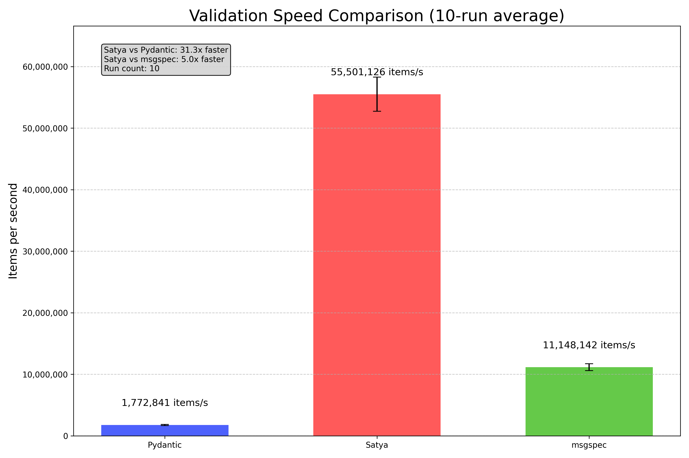

# Tatsat

A lightning-fast web framework with FastAPI-compatible syntax and superior performance. Built on Starlette with Satya for ultra-efficient data validation, Tatsat delivers all the developer-friendly features of FastAPI with dramatically better performance.

## 🎯 Why Tatsat Exists

Tatsat was created to solve a fundamental limitation: FastAPI is tightly coupled with Pydantic, making it nearly impossible to replace Pydantic with a faster validation system. Even when implementing custom route handlers in FastAPI, Pydantic is still used under the hood for request/response processing, severely limiting performance optimization potential.

**The solution?** Build a framework with FastAPI's elegant interface but powered by Satya, a validation library that delivers exceptional performance:

## ⚡ Performance Highlights

Tatsat outperforms FastAPI by a wide margin in both validation speed and HTTP request handling:

### 🚀 Validation Performance


| Payload Type | Tatsat + Satya | FastAPI + Pydantic | Improvement |
|--------------|----------------|-------------------|-------------|
| Simple       | 1,916,870      | 463,372           | **314% faster** |
| Medium       | 1,704,724      | 483,471           | **253% faster** |
| Complex      | 1,572,373      | 243,905           | **545% faster** |

### 🔥 HTTP Performance
| Metric        | Tatsat      | FastAPI    | Improvement |
|---------------|-------------|------------|-------------|
| Requests/sec  | 20,438      | 7,310      | **179% faster** |
| Avg Latency   | 0.22ms      | 0.64ms     | **66% lower** |

*See the [benchmarks](/benchmarks) directory for detailed methodology and results*

## 🌟 Features

Tatsat provides everything FastAPI offers and more:

- **Modern ASGI Framework**: Built on Starlette, just like FastAPI
- **Intuitive API**: Similar interface to FastAPI for minimal learning curve
- **Superior Validation**: Satya's validation engine is 30x faster than Pydantic, 5x faster than msgspec
- **Type Safety**: Full support for Python type hints
- **Automatic API Documentation**: Swagger UI and ReDoc integration
- **Powerful Dependency Injection**: Clean, modular code with dependency management
- **Path Operations**: Intuitive route decorators for all HTTP methods
- **Advanced Middleware Support**: Flexible middleware system
- **Exception Handling**: Comprehensive exception management
- **APIRouter**: Route organization with prefixes and tags
- **WebSocket Support**: Real-time bi-directional communication
- **Background Tasks**: Efficient asynchronous task processing
- **Security Utilities**: OAuth2, JWT, and other authentication systems
- **Testing Utilities**: Easy endpoint testing

## 💨 Why Satya Outperforms Pydantic

Satya achieves its remarkable performance through:

1. **Optimized Type Checking**: Highly efficient type validation algorithms
2. **Reduced Object Overhead**: Minimized memory allocations during validation
3. **Custom Validator Compilation**: Runtime-optimized validator functions
4. **Pure Python Implementation**: No complex C-extensions, yet better performance
5. **Efficient Error Handling**: Streamlined error reporting with minimal overhead
6. **Fewer Nested Function Calls**: Flatter execution path for faster validation
7. **Type Coercion Optimizations**: Smart type conversions without unnecessary operations

## 📦 Installation

```bash
# Install from PyPI
pip install tatsat

# Or install directly from the repository
pip install -e .

# Make sure you have satya installed
pip install satya
```

## 🚀 Quick Start

Here's a minimal example to get you started:

```python
from tatsat import Tatsat
from satya import Model, Field
from typing import List, Optional

app = Tatsat(title="Tatsat Demo")

# Define your data models with Satya
class Item(Model):
    name: str = Field()
    description: Optional[str] = Field(required=False)
    price: float = Field(gt=0)
    tax: Optional[float] = Field(required=False)
    tags: List[str] = Field(default=[])

# Create API endpoints with typed parameters
@app.get("/")
def read_root():
    return {"Hello": "World"}

@app.get("/items/{item_id}")
def read_item(item_id: int, q: Optional[str] = None):
    return {"item_id": item_id, "q": q}

@app.post("/items/", response_model=Item)
def create_item(item: Item):
    return item

# Run the application with Uvicorn
if __name__ == "__main__":
    import uvicorn
    uvicorn.run(app, host="0.0.0.0", port=8000)
```

## 🧩 Core Concepts

### Application

The `Tatsat` class is the main entry point for creating web applications:

```python
from tatsat import Tatsat

app = Tatsat(
    title="Tatsat Example API",
    description="A sample API showing Tatsat features",
    version="0.1.0",
    debug=False
)
```

### Path Operations

Tatsat provides decorators for all standard HTTP methods:

```python
@app.get("/")
@app.post("/items/")
@app.put("/items/{item_id}")
@app.delete("/items/{item_id}")
@app.patch("/items/{item_id}")
@app.options("/items/")
@app.head("/items/")
```

### Path Parameters

Path parameters are part of the URL path and are used to identify a specific resource:

```python
@app.get("/items/{item_id}")
def read_item(item_id: int):
    return {"item_id": item_id}
```

### Query Parameters

Query parameters are optional parameters appended to the URL:

```python
@app.get("/items/")
def read_items(skip: int = 0, limit: int = 10):
    return {"skip": skip, "limit": limit}
```

### Request Body

Request bodies are parsed and validated using Satya models:

```python
@app.post("/items/")
def create_item(item: Item):
    return item
```

### Dependency Injection

Tatsat includes a powerful dependency injection system:

```python
def get_db():
    db = Database()
    try:
        yield db
    finally:
        db.close()

@app.get("/items/")
def read_items(db = Depends(get_db)):
    return db.get_items()
```

### Response Models

Specify response models for automatic serialization and documentation:

```python
@app.get("/items/{item_id}", response_model=Item)
def read_item(item_id: int):
    return get_item_from_db(item_id)
```

## 🔋 Advanced Features

### Background Tasks

Tatsat supports efficient background task processing without blocking the main request:

```python
from tatsat import BackgroundTasks

@app.post("/send-notification/{email}")
async def send_notification(email: str, background_tasks: BackgroundTasks):
    background_tasks.add_task(send_email_notification, email, message="Welcome!")
    return {"message": "Notification will be sent in the background"}
```

For more complex task processing, Tatsat can integrate with:
- **asyncio.create_task()** for simple async tasks
- **arq** for Redis-based task queues
- **Celery** for distributed task processing
- **Dramatiq** for simple but powerful task processing

### API Routers

Organize your routes using the `APIRouter`:

```python
from tatsat import APIRouter

router = APIRouter(prefix="/api/v1")

@router.get("/items/")
def read_items():
    return {"items": []}

app.include_router(router)
```

### Middleware

Add middleware for cross-cutting concerns:

```python
@app.middleware("http")
async def add_process_time_header(request, call_next):
    start_time = time.time()
    response = await call_next(request)
    process_time = time.time() - start_time
    response.headers["X-Process-Time"] = str(process_time)
    return response
```

### Exception Handlers

Custom exception handlers:

```python
@app.exception_handler(404)
async def not_found_exception_handler(request, exc):
    return JSONResponse(
        status_code=404,
        content={"message": "Resource not found"}
    )
```

### WebSockets

Real-time bi-directional communication:

```python
@app.websocket("/ws")
async def websocket_endpoint(websocket: WebSocket):
    await websocket.accept()
    while True:
        data = await websocket.receive_text()
        await websocket.send_text(f"Message received: {data}")
```

### OAuth2 and Security

Comprehensive security features:

```python
from tatsat.security import OAuth2PasswordBearer, OAuth2PasswordRequestForm

oauth2_scheme = OAuth2PasswordBearer(tokenUrl="token")

@app.post("/token")
async def login(form_data: OAuth2PasswordRequestForm = Depends()):
    user = authenticate_user(form_data.username, form_data.password)
    if not user:
        raise HTTPException(status_code=400, detail="Invalid credentials")
    return {"access_token": create_access_token(user), "token_type": "bearer"}

@app.get("/users/me")
async def read_users_me(token: str = Depends(oauth2_scheme)):
    user = get_current_user(token)
    return user
```

## 📈 Why Choose Tatsat Over FastAPI?

Tatsat combines the best of both worlds:

1. **Familiar API**: If you know FastAPI, you already know Tatsat
2. **Exceptional Performance**: 30x faster validation, 2x higher HTTP throughput
3. **True Framework Independence**: Built from the ground up to avoid Pydantic dependency 
4. **Production Ready**: Built with performance and reliability in mind
5. **Feature Complete**: Everything FastAPI has, with superior performance
6. **Future Proof**: Actively maintained and improved

## 🔮 What's Next?

Tatsat is actively being developed with a focus on:

1. **Even Better Performance**: Continuous optimization efforts
2. **Enhanced Validation Features**: More validation options with Satya
3. **Advanced Caching**: Integrated caching solutions
4. **GraphQL Support**: Native GraphQL endpoint creation
5. **More Middleware**: Additional built-in middleware options

## 📚 Learning Resources

- [Examples](/examples): Practical examples for various use cases
- [Benchmarks](/benchmarks): Detailed performance comparisons
- [Documentation](/docs): Comprehensive documentation

## 📜 License

This project is licensed under the MIT License - see the [LICENSE](/LICENSE) file for details.

## 🙏 Acknowledgements

Tatsat builds upon the excellent work of the Starlette and FastAPI projects, offering a compatible API with dramatically improved performance.
