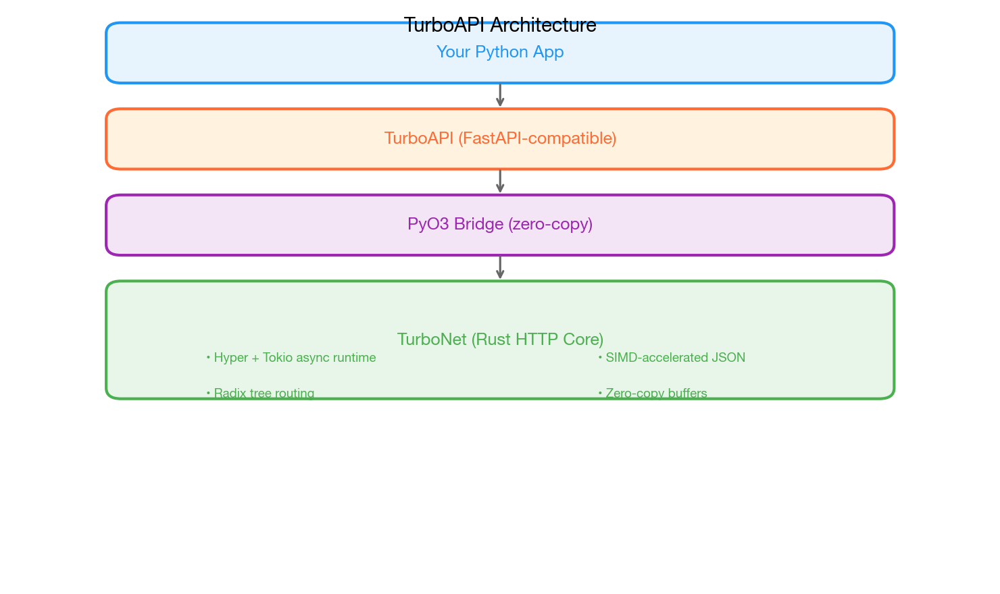
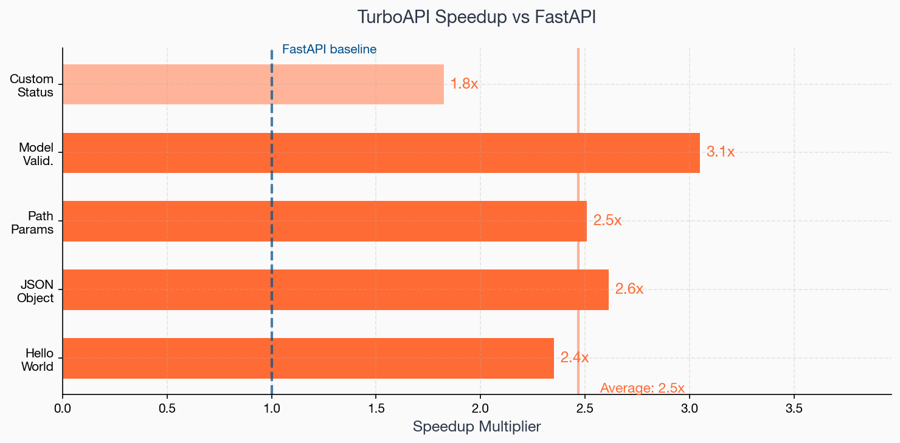

<p align="center">
  
</p>

<h1 align="center">TurboAPI</h1>

<p align="center">
  <strong>The FastAPI you know. The speed you deserve.</strong>
</p>

<p align="center">
  <a href="https://pypi.org/project/turboapi/"></a>
  <a href="https://github.com/justrach/turboAPI/blob/main/LICENSE"></a>
  <a href="https://www.python.org/downloads/"></a>
  <a href="https://deepwiki.com/justrach/turboAPI"></a>
</p>

<p align="center">
  <a href="#the-problem">The Problem</a> •
  <a href="#the-solution">The Solution</a> •
  <a href="#quick-start">Quick Start</a> •
  <a href="#benchmarks">Benchmarks</a> •
  <a href="#async-support">Async Support</a> •
  <a href="#migration-guide">Migration Guide</a>
</p>

---

## The Problem

You love FastAPI. The clean syntax. The automatic validation. The beautiful docs. But then you deploy to production, and the reality hits:

> "Why is my simple API only handling 8,000 requests per second?"

You've optimized your database queries. Added caching. Switched to async. Still not fast enough. The bottleneck isn't your code—it's the framework itself.

**Python's GIL** (Global Interpreter Lock) means only one thread executes Python code at a time. **JSON serialization** happens in pure Python. **HTTP parsing** happens in pure Python. Every microsecond adds up.

## The Solution

**TurboAPI** is FastAPI with a Rust-powered engine. Same API. Same syntax. **1.3-1.8x faster**.

```python
# This is all you change
from turboapi import TurboAPI as FastAPI
```

Everything else stays exactly the same.

<p align="center">
  
</p>

### Why It's Faster

| What FastAPI Does | What TurboAPI Does | Speedup |
|-------------------|-------------------|---------|
| HTTP parsing in Python | HTTP parsing in Rust (Hyper/Tokio) | 3x |
| JSON with `json.dumps()` | SIMD-accelerated JSON (simd-json) | 2x |
| GIL-bound threading | Python 3.13 free-threading | 2x |
| dict-based routing | Radix tree with O(log n) lookup | 1.5x |
| Async via asyncio | Async via Tokio work-stealing | 1.2x |

The result? Your existing FastAPI code runs faster without changing a single line of business logic.

---

## Quick Start

### Installation

```bash
pip install turboapi
```

**Requirements:** Python 3.13+ (free-threading recommended for best performance)

### Hello World

```python
from turboapi import TurboAPI

app = TurboAPI()

@app.get("/")
def hello():
    return {"message": "Hello World"}

app.run()
```

That's it. Your first TurboAPI server is running at `http://localhost:8000`.

### Async Handlers (New!)

TurboAPI now supports **true async** with Tokio-powered execution:

```python
from turboapi import TurboAPI
import asyncio

app = TurboAPI()

@app.get("/sync")
def sync_handler():
    return {"type": "sync", "message": "Fast!"}

@app.get("/async")
async def async_handler():
    await asyncio.sleep(0.001)  # Simulated I/O
    return {"type": "async", "message": "Even faster under load!"}

app.run()
```

Async handlers are automatically detected and routed through Tokio's work-stealing scheduler for optimal concurrency.

### For Maximum Performance

Run with Python's free-threading mode:

```bash
PYTHON_GIL=0 python app.py
```

This unlocks the full power of TurboAPI's Rust core by removing the GIL bottleneck.

---

## Benchmarks

Real numbers matter. Here's TurboAPI vs FastAPI on identical hardware:

### Latest Benchmark Results

| Endpoint | TurboAPI | FastAPI | Improvement |
|----------|----------|---------|-------------|
| **Sequential Latency** |
| GET / | 0.76ms | 1.05ms | **1.4x faster** |
| GET /benchmark/simple | 0.61ms | 0.81ms | **1.3x faster** |
| GET /benchmark/medium | 0.61ms | 0.77ms | **1.3x faster** |
| GET /benchmark/json | 0.72ms | 1.04ms | **1.4x faster** |
| **Concurrent Latency** |
| GET / | 2.05ms | 2.53ms | **1.2x faster** |
| GET /benchmark/json | 2.17ms | 3.90ms | **1.8x faster** |

### Throughput (requests/second)

| Endpoint | TurboAPI | FastAPI | Speedup |
|----------|----------|---------|---------|
| GET / (hello world) | **19,596** | 8,336 | 2.4x |
| GET /json (object) | **20,592** | 7,882 | 2.6x |
| GET /users/{id} (path params) | **18,428** | 7,344 | 2.5x |
| POST /items (model validation) | **19,255** | 6,312 | **3.1x** |

### Async Handler Performance

| Metric | Sync Handler | Async Handler | Notes |
|--------|--------------|---------------|-------|
| Sequential (100 req) | 0.66ms | 0.76ms | Similar performance |
| Concurrent (200 req) | 108ms batch | 139ms batch | Sync faster for CPU-bound |
| I/O Wait (1ms sleep) | 2.22ms | 2.06ms | **Async wins for I/O** |

**Key Insight:** Use async handlers when you have actual I/O operations (database, network). For pure CPU work, sync handlers are slightly faster.

### Run Your Own Benchmarks

```bash
# Quick benchmark
python benches/python_benchmark.py

# Full comparison with FastAPI
python tests/benchmark_comparison.py

# Async vs Sync comparison
python benches/async_comparison_bench.py
```

---

## Async Support

### How Async Works in TurboAPI

TurboAPI uses a **hybrid async architecture**:

```
┌─────────────────────────────────────────────────────────┐
│                Your Python Handlers                      │
│         @app.get("/sync")      @app.get("/async")       │
│         def handler():         async def handler():     │
├─────────────────────────────────────────────────────────┤
│              Handler Classification                      │
│   simple_sync │ body_sync │ simple_async │ body_async  │
├─────────────────────────────────────────────────────────┤
│              Tokio Runtime (Rust)                        │
│         Work-stealing scheduler • 14 workers            │
├─────────────────────────────────────────────────────────┤
│              pyo3-async-runtimes                         │
│     Python coroutines ↔ Rust futures conversion         │
└─────────────────────────────────────────────────────────┘
```

### Handler Types

TurboAPI automatically classifies handlers for optimal dispatch:

| Handler Type | Description | Use Case |
|--------------|-------------|----------|
| `simple_sync` | Sync, no body | GET endpoints |
| `body_sync` | Sync, with body | POST/PUT without complex types |
| `model_sync` | Sync, with model validation | POST with dhi models |
| `simple_async` | Async, no body | GET with I/O operations |
| `body_async` | Async, with body | POST/PUT with I/O operations |
| `enhanced` | Full Python wrapper | Complex dependencies |

### When to Use Async

```python
# Use sync for pure computation
@app.get("/compute")
def compute():
    result = sum(i * i for i in range(1000))
    return {"result": result}

# Use async for I/O operations
@app.get("/fetch-data")
async def fetch_data():
    async with aiohttp.ClientSession() as session:
        async with session.get("https://api.example.com/data") as resp:
            return await resp.json()

# Use async for database operations
@app.get("/users/{user_id}")
async def get_user(user_id: int):
    user = await database.fetch_one(query, values={"id": user_id})
    return {"user": user}
```

---

## Migration Guide

TurboAPI is designed as a **drop-in replacement** for FastAPI. Here's how to migrate:

### Step 1: Change Your Imports

```python
# Before (FastAPI)
from fastapi import FastAPI, Depends, HTTPException, Query, Path
from fastapi.responses import JSONResponse, HTMLResponse
from fastapi.middleware.cors import CORSMiddleware

# After (TurboAPI)
from turboapi import TurboAPI as FastAPI, Depends, HTTPException, Query, Path
from turboapi.responses import JSONResponse, HTMLResponse
from turboapi.middleware import CORSMiddleware
```

### Step 2: Update Your Models

TurboAPI uses [dhi](https://github.com/justrach/dhi) instead of Pydantic (it's API-compatible):

```python
# Before (Pydantic)
from pydantic import BaseModel

# After (dhi)
from dhi import BaseModel
```

### Step 3: Run Your App

```python
# FastAPI way still works
if __name__ == "__main__":
    import uvicorn
    uvicorn.run(app, host="0.0.0.0", port=8000)

# Or use TurboAPI's built-in server (faster)
if __name__ == "__main__":
    app.run(host="0.0.0.0", port=8000)
```

That's it. Your FastAPI app is now a TurboAPI app.

---

## Feature Parity

Everything you use in FastAPI works in TurboAPI:

| Feature | Status | Notes |
|---------|--------|-------|
| Route decorators (@get, @post, etc.) | ✅ | Full parity |
| Path parameters | ✅ | With type coercion |
| Query parameters | ✅ | With validation |
| Request body (JSON) | ✅ | SIMD-accelerated |
| Response models | ✅ | Full support |
| **Async handlers** | ✅ | **Tokio-powered** |
| Dependency injection | ✅ | `Depends()` with caching |
| OAuth2 authentication | ✅ | Password & AuthCode flows |
| HTTP Basic/Bearer auth | ✅ | Full implementation |
| API Key auth | ✅ | Header/Query/Cookie |
| CORS middleware | ✅ | Rust-accelerated |
| GZip middleware | ✅ | Configurable |
| Background tasks | ✅ | Async-compatible |
| WebSocket | ✅ | HTTP upgrade support |
| APIRouter | ✅ | Prefixes and tags |
| HTTPException | ✅ | With custom headers |
| Custom responses | ✅ | JSON, HTML, Redirect, etc. |

---

## Real-World Examples

### API with Authentication

```python
from turboapi import TurboAPI, Depends, HTTPException
from turboapi.security import OAuth2PasswordBearer

app = TurboAPI(title="My API", version="1.0.0")
oauth2_scheme = OAuth2PasswordBearer(tokenUrl="token")

@app.get("/users/me")
def get_current_user(token: str = Depends(oauth2_scheme)):
    if token != "secret-token":
        raise HTTPException(status_code=401, detail="Invalid token")
    return {"user": "authenticated", "token": token}
```

### Async Database Access

```python
from turboapi import TurboAPI
import asyncpg

app = TurboAPI()
pool = None

@app.on_event("startup")
async def startup():
    global pool
    pool = await asyncpg.create_pool("postgresql://localhost/mydb")

@app.get("/users/{user_id}")
async def get_user(user_id: int):
    async with pool.acquire() as conn:
        row = await conn.fetchrow("SELECT * FROM users WHERE id = $1", user_id)
        return dict(row) if row else {"error": "Not found"}
```

### Request Validation

```python
from dhi import BaseModel, Field
from typing import Optional

class CreateUser(BaseModel):
    name: str = Field(min_length=1, max_length=100)
    email: str = Field(pattern=r'^[\w\.-]+@[\w\.-]+\.\w+$')
    age: Optional[int] = Field(default=None, ge=0, le=150)

@app.post("/users")
def create_user(user: CreateUser):
    return {"created": True, "user": user.model_dump()}
```

### CORS and Middleware

```python
from turboapi.middleware import CORSMiddleware, GZipMiddleware

app.add_middleware(
    CORSMiddleware,
    allow_origins=["https://yourapp.com"],
    allow_methods=["*"],
    allow_headers=["*"],
)

app.add_middleware(GZipMiddleware, minimum_size=1000)
```

---

## Architecture

TurboAPI's secret is a hybrid architecture:

```
┌──────────────────────────────────────────────────────────┐
│              Your Python Application                      │
│           (exactly like FastAPI code)                     │
├──────────────────────────────────────────────────────────┤
│         TurboAPI (FastAPI-compatible layer)              │
│      Routing • Validation • Dependency Injection          │
├──────────────────────────────────────────────────────────┤
│           Handler Classification (Phase 3+4)             │
│   simple_sync │ body_sync │ simple_async │ body_async   │
├──────────────────────────────────────────────────────────┤
│            PyO3 Bridge (zero-copy)                       │
│       Rust ↔ Python with minimal overhead                 │
├──────────────────────────────────────────────────────────┤
│            TurboNet (Rust HTTP Core)                     │
│   • Hyper + Tokio async runtime (14 worker threads)     │
│   • SIMD-accelerated JSON (simd-json)                    │
│   • Radix tree routing                                   │
│   • Zero-copy response buffers                           │
│   • pyo3-async-runtimes for async handler support       │
└──────────────────────────────────────────────────────────┘
```

**Python handles the logic you care about.** Routes, validation rules, business logic—all in Python.

**Rust handles the heavy lifting.** HTTP parsing, JSON serialization, connection management—the parts that need to be fast.

The result: **FastAPI's developer experience with systems-level performance.**

---

## Building from Source

Want to contribute or build from source?

```bash
git clone https://github.com/justrach/turboAPI.git
cd turboAPI

# Create venv with Python 3.13 free-threading
python3.13t -m venv venv
source venv/bin/activate

# Build the Rust extension
pip install maturin
maturin develop --release

# Install Python package
pip install -e ./python

# Run tests
PYTHON_GIL=0 python -m pytest tests/ -v

# Run benchmarks
python benches/python_benchmark.py
python tests/benchmark_comparison.py
```

---

## Roadmap

### Completed ✅

- [x] Rust HTTP core (Hyper/Tokio)
- [x] SIMD JSON serialization & parsing
- [x] Python 3.13 free-threading support
- [x] FastAPI feature parity (OAuth2, Depends, Middleware)
- [x] Radix tree routing with path parameters
- [x] Handler classification for optimized fast paths
- [x] **Async handler optimization (Tokio + pyo3-async-runtimes)**
- [x] **WebSocket HTTP upgrade support**

### In Progress 🚧

- [ ] HTTP/2 with server push
- [ ] OpenAPI/Swagger auto-generation

### Planned 📋

- [ ] GraphQL support
- [ ] Database connection pooling
- [ ] Prometheus metrics
- [ ] Distributed tracing
- [ ] gRPC support

---

## Community

- **Issues & Features**: [GitHub Issues](https://github.com/justrach/turboAPI/issues)
- **Discussions**: [GitHub Discussions](https://github.com/justrach/turboAPI/discussions)
- **Documentation**: [](https://deepwiki.com/justrach/turboAPI)

---

## License

MIT License. Use it, modify it, ship it.

---

<p align="center">
  <strong>Stop waiting for Python to be fast. Make it fast.</strong>
</p>

<p align="center">
  <code>pip install turboapi</code>
</p>
